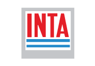

***
# Presentación
---
## Sobre Mikroways

* Brindamos servicios de TI, específicamente relacionados a la infraestructura
  tecnológica de nuestros clientes. 
* Diseñamos e implementamos soluciones a medida según las necesidades de cada
  cliente.
* Damos soporte para solucionar cualquier problemática que surja en el
  funcionamiento de la infraestructura tecnológica existente.
* Proveemos capacitación al personal de sistemas, adaptando los cursos a los
  requerimientos específicos.

---
## Sobre Mikroways

**Algunos de nuestros clientes**
<table class="product_logos">
<tr>
  <td>  </td>
  <td>      </td>
  <td>  </td>
</tr>
<tr>
  <td>  </td>
  <td>  </td>
  <td>  </td>
</tr>
<tr>
  <td>  </td>
  <td>  </td>
  <td>  </td>
</tr>
</table>

---
## Nuestros servicios
* Devops.
* Computación en la nube.
* Consultoría.
* Escalabilidad de aplicaciones web.
* Outsourcing.
* Monitoreo inteligente.
* Capacitación.
***
