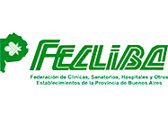

***
# Presentación
---
## Sobre Mikroways

* Brindamos servicios de TI, específicamente relacionados a la infraestructura
  tecnológica de nuestros clientes. 
* Diseñamos e implementamos soluciones a medida según las necesidades de cada
  cliente.
* Damos soporte para solucionar cualquier problemática que surja en el
  funcionamiento de la infraestructura tecnológica existente.
* Proveemos capacitación al personal de sistemas, adaptando los cursos a los
  requerimientos específicos.

---
## Sobre Mikroways

**Algunos de nuestros clientes**
<table class="product_logos">
<tr>
  <td>  </td>
  <td>      </td>
  <td>  </td>
</tr>
<tr>
  <td>  </td>
  <td>  </td>
  <td>  </td>
</tr>
<tr>
  <td>  </td>
  <td>  </td>
  <td>  </td>
</tr>
</table>

---
## Nuestros servicios
* Devops
* Computación en la nube
* Consultoría
* Escalabilidad de aplicaciones web
* Outsourcing
* Monitoreo inteligente
* Capacitación
---
## Presentación personal

* Docente en UNLP
* Trabajé en IT mayormente de 2000 a 2007
* Dicté cursos de CCNA/RedHat/Solaris/IRIX
* A partir de 2006 me aboqué al desarrollo web y coordinación de proyectos de
  software
  * Empecé con Devops en 2012
  * [Capacitación sobre chef 2013](http://chrodriguez.github.io/capacitacion_chef/)
* Trabajos freelance de IT
---
## Contribuciones al SL

* Mi perfil en [Github](https://github.com/chrodriguez)
* [Ruby Scripting para Spoon de Pentaho](https://github.com/slawo-ch/ruby-scripting-for-pdi) (Kettle)
* [chef-provisioning-vsphere](https://github.com/CenturyLinkCloud/chef-provisioning-vsphere)
* [chef-provisioning-fog](Soporte://github.com/chef/chef-provisioning-fog)
* [Redmine SAML plugin](https://github.com/chrodriguez/redmine_omniauth_saml)
* [Redmine per project sender plugin](https://github.com/chrodriguez/redmine_per_project_sender)
* [xmltv tv\_grab\_ar](http://wiki.xmltv.org/index.php/Main_Page)
* [VDR - The Video Recorder Disk](http://www.tvdr.de/)
* Varias recetas de chef
* Varias gemas de ruby
* Plugins para Symfony 1.x

---
## Experiencia relevante en la temática

* Gestión de la infraestructura: email y web en SMN (2005 al 2007)
* Consultoría en SENASA (2007 a la fecha)
  * Definición e implementación de un LDAP replicado e integrado con AD
  * Implementación de SSO
  * Arquitectura, implementación y mantenimiento del email
* Portal del diario El Día (2012 a la fecha)
  * Arquitectura y desarrollo del producto
  * Diseño de la arquitectura inicial de su infraestructura

***
