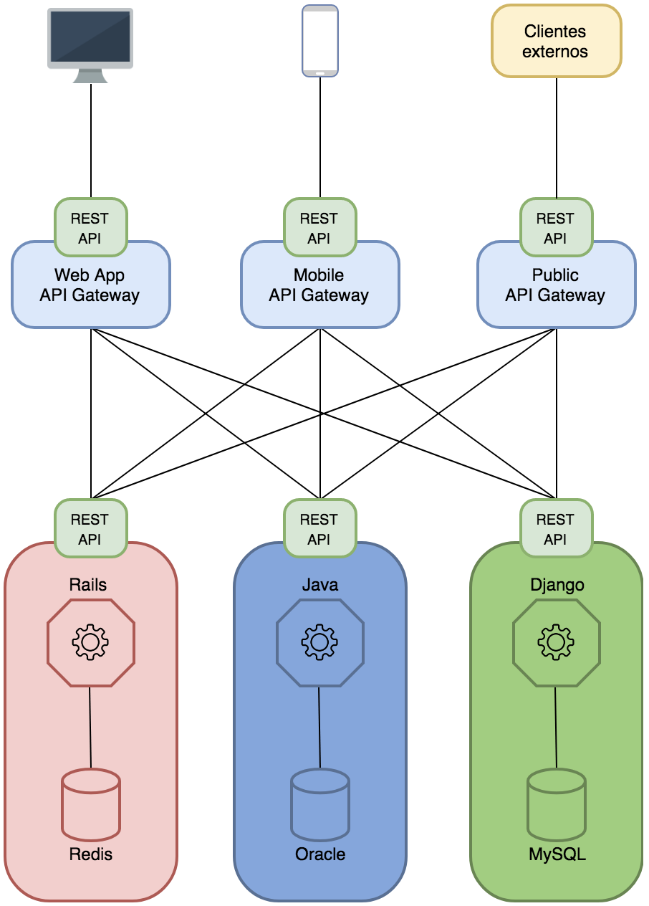

***
# La perspectiva de desarrollo
---

## Arquitectura de aplicaciones

* Monolíticas versus servicios o microservicios.
* Múltiples lenguajes y frameworks.
* Diferentes sistemas de bases de datos:
  * SQL, NoSQL.
* Sistemas de colas.
* Servicios de terceros.
---

### Arquitecturas de aplicaciones

<tr>
  <td></td>
  <td></td>
</tr>
---

## Metodologías Ágiles

* El [manifiesto ágil](http://www.agilemanifesto.org/iso/es/) hace énfasis en
  los siguientes valores:
  * individuos e interacciones,
  * software funcionando,
  * colaboración con el cliente,
  * respuesta ante el cambio.
* Desplegar nuevas versiones con mucha frecuencia:
  * Aparecen deployments diarios e incluso varias veces al día.
  * Responder a estos requerimientos requiere una operatoria ágil desde IT.
      * Si esto no sucede se produce un cuello de botella.
---

## Versiones de librerías y lenguajes

* Es común que los desarrolladores utilicen las versiones más recientes de
  determinados productos.
* Algunos lenguajes no permiten, *de forma simple*, tener en el sistema más de
  una versión de una misma librería o lenguaje.
* Esto crea diferencias entre el ambiente de desarrollo y producción.
  * Es esta es la brecha que debemos achicar.
---

## Ambiente de desarrollo

* Suele darse uno de tres escenarios.
  * No existen ambientes de desarrollo:
      * ¡se trabaja directamente en producción!
  * Ambiente de desarrollo común y compartido:
      * difícil administración,
      * problemas de concurrencia
  * Ambientes independientes de desarrollo:
      * Nuevo integrante debe generar todo el ambiente de cero.
      * Necesidad de sincronizar cambios entre desarrolladores (código,
        estructura de bases de datos).
---

## Acceso a producción

* Suele ser necesario acceder a un recurso en producción.
  * Dump de la BD o versión productiva del código (¡SCM!).
  * Datos dinámicos de la aplicación.
      * Archivos subidos o generados durante su uso.
* A veces, por requerimientos de seguridad o legales, la información debe
  obtenerse ofuscada.
* Otras veces, alcanza con un dato antiguo que puede extraerse desde un backup.
---

## Réplica del ambiente productivo

* Disponer de un ambiente similar al productivo es muy valioso para desarrollo
  porque permite, entre otras cosas:
  * Verificar problemas sin tocar producción.
  * Probar nuevos releases antes de pasarlos a producción.
  * Asegurarse que el código, que funciona en el ambiente de desarrollo,
    funcione en el de producción.
      * ¿Y si el ambiente de desarrollo fuera igual al del producción?
  * Que el cliente verifique los cambios solicitados antes de aplicarlos en
    producción.
---

## Diagnóstico de problemas

* Comportamiento del software en producción:
  * importancia de poder visualizar los logs:
      * Errores
      * Problemas de seguridad.
      * Otras situaciones anómalas.
  * Monitoreo del software:
      * Aviso en tiempo real cuando se produce una excepción.
---

## Diagnóstico de problemas

* Profiling de cada middleware de una aplicación: ORM, servicios externos,
  renderizado, caching, tiempos de respuesta, etc.
* Generar información estadística para conocer el comportamiento normal de
  cada aplicación:
  * Desconocer estos datos es manejar con el parabrisas lleno de barro.
***
