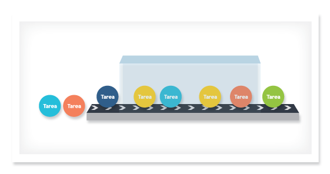

***
# Puesta en producción

### El momento en que desarrollo e infraestructura interactúan
---

## Puesta en producción

* Deben definirse procedimientos para:
  * Deploy de nuevas aplicaciones.
  * Upgrade de aplicaciones existentes.
  * Rollback
* ¿Cómo se actualiza una base de datos?
  * ¡¿Y el rollback?!
* ¿Infraestructura y desarrollo deberían hacerlo en conjunto?
  * ¿README con instrucciones?
---

## Puesta en producción

* Cada caso requiere tiempo y, muchas veces, poner los sistemas offline.
* Con las formas tradicionales de desarrollo:
  * Pasaban semanas entre cambios en producción.
  * Algunas organizaciones tenían días definidos para la puesta en producción.
---

## Puesta en producción

---

## Puesta en producción

* Con las metodologías ágiles los cambios en producción **deben** ser muy
  frecuentes.
* Infraestructura no cuenta con las herramientas necesarias para agilizar la
  puesta en producción de forma segura.
  * ¡Es un trabajo manual!
* La promesa de las metologías ágiles encuentra un importante obstáculo...
---

## Puesta en producción

---

## Deploy de nuevas aplicaciones

* Es el caso ideal, se arranca sin historia previa.
* Se deben considerar varias cuestiones:
  * La aplicación corre con un usuario determinado.
  * Crear la estructura de directorios necesaria.
  * Instalación de servicios que son requeridos:
      * Rotación de logs.
      * Servicios asincrónicos.
      * Creación de usuarios y bases de datos necesarios.
  * Definir y aplicar las políticas de backups.
  * Estadísticas y monitoreo.
---

## Upgrade de aplicación existente

* Revisar si alguno de los puntos considerados en el caso anterior varía.
* Actualizar el código, preservando en lo posible la versión anterior.
* Aplicar parches necesarios a la base de datos.
* Poner el sistema offline es la solución más segura pero no siempre es una
  opción:
  * [Blue-green deployment](http://martinfowler.com/bliki/BlueGreenDeployment.html)
---

## Rollback

* Es volver atrás los cambios realizados.
  * Los cambios no funcionan según lo esperando.
* Conservando una copia del código anterior, se vuelve a apuntar a esa versión.
  * Usando links simbólicos es muy simple.
  * Si hay cambios en la base de datos ya no es tan sencillo.
* Si se utiliza blue green deployments, entonces sólo se cambia el proxy
  reverso.
  * Si la base de datos se puso en sólo lectura.
---

## Actualizaciones de las bases de datos

* El versionado del código resuelve la simplicidad de actualizar y realizar
  rollbacks.
  * Con las bases de datos no sucede lo mismo.
* Versionar la estructura de la BD con el código no aporta demasiado.
  * Cómo aplicar un parche a un modelo y deshacerlo en caso de rollback.
  * Estos parches deben ser idempotentes.
  * No siempre un parche a una BD tiene vuelta atrás.
* Algunos parches pueden ser costosos en BBDD grandes.
---

## Otras cuestiones a considerar

* Ante un cambio de versión es aconsejable notificar a los usuarios con
  anticipación de la interrupción del servicio.
  * Requiere conocer el dominio de usuarios afectados.
  * Programar el envío masivo de correos.
  * Planificar y notificar con anticipación mejoran la calidad del servicio.
* Gestión de contratos:
  * Cumplir con el SLA.
  * Vencimiento de hosting.
***
