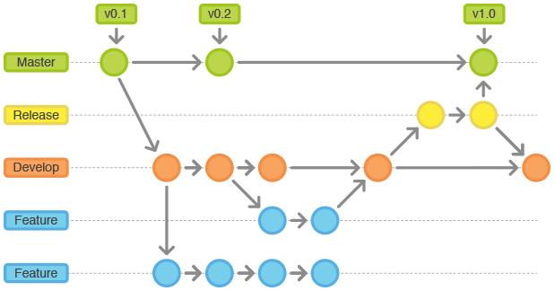

***
# DevOps
---

## ¿Qué es DevOps?

* Metodología para el desarrollo y puesta en producción del software.
* Promueve una fuerte integración y colaboración entre desarolladores de
  software y administradores de sistemas.
* Incrementa la productividad de los equipos, al mismo tiempo que permite
  generar software de mayor calidad, con una alta frecuencia de despliegues en
  producción.
---

## ¿Qué es DevOps?

* Se lo suele asociar a una filosofía, pero es porque en realidad requiere un
  importante cambio cultural.
  * Acerca mucho las áreas de desarrollo e infraestructura.
      * El mayor impacto se da en esta última.
  * El cambio cultural es la barrera más difícil de superar para su adopción.
---

## Orígenes

* Aproximadamente en el año 2009, ante la convergencia de diferentes trabajos:
  *  Las conferencias Velocity, en particular la presentación ["10 deploys per
  day - Dev & Ops cooperation at Flickr"](https://www.youtube.com/watch?v=LdOe18KhtT4)
      * Aquí además se acuña el término.
  * Los movimientos de *IaC (Infraestructure as Code)*, *Agile infraestructure*
    y *Agile system administration*.
  * El movimiento de [Lean Startup](http://theleanstartup.com/principles).
  * El movimiento de integración y despliegue continuo.
---

## Orígenes

* La gran disponibilidad de tecnologías de cloud: PaaS/IaaS.
  * AWS
  * Google Compute Engine
  * Microsoft Azure
  * Heroku
  * Digital Ocean
  * Softlayer
  * Rackspace
---

## Orígenes

Como recurso adicional, hay un [interesante
video](https://www.youtube.com/watch?v=o7-IuYS0iSE) de Damon Edwards que resume
la historia de DevOps (¡hasta 2012!).
---

## Caracterización

* DevOps se ajusta perfectamente a las metodologías ágiles:
  * extiende y completa el proceso de integración y despliegue continuo,
    asegurando que el código esté listo para producción, agregando así valor
    para los clientes.
* Surge un nuevo perfil profesional:
  * La organización que desea incorporar DevOps debe formar a sus
    desarrolladores y administradores de sistemas para reunir las capacidades y
    conocimientos requeridos.
      * Desarrolladores que piensan como administradores y administradores que
        piensan como desarrolladores.
---

## Infraestructure as code

* IaC es el proceso por el cuál se gestionan y aprovisionan máquinas (físicas o
  virtuales) completas.
* Este aprovisionamiento se realiza a través de archivos de configuración que
  son interpretados por alguna herramienta de orquestación.
* Estos archivos de configuración se versionan en un SCM.
* Se programa una vez y se repite miles de veces.

---

## Infraestructure as code

* Claves:
  * Idempotencia
  * Multiplataforma
  * Flexibilidad
  * ¿Facilidad de aprendizaje?

---
## Herramientas

Existen diversos productos que se basan en IaC
<table class="product_logos">
<tr>
<td>  </td><td> [Chef](https://www.chef.io/) </td>
</tr>
<tr>
<td>  </td><td> [Puppet Labs](https://puppet.com/) </td>
</tr>
<tr>
<td>  </td><td> [Ansible](https://www.ansible.com/) </td>
</tr>
<tr>
<td>  </td><td> [SaltStack](https://saltstack.com/) </td>
</tr>
</table>
---

## Test de la infraestructura

* Si la infraestructura se puede programar... ¡también se puede testear!
* Tests de unidad:
  * [rspec-puppet](http://rspec-puppet.com/)
  * [ChefSpec](https://github.com/sethvargo/chefspec)
* Tests de integración
  * [ServerSpec](http://serverspec.org/)
  * [Kitchen CI](https://kitchen.ci)

---

## Conceptos relacionados

* A continuación describiremos brevemente los siguientes conceptos:
  * Integración continua (continuous integration).
  * Entrega continua (continuous delivery).
  * Despliegue continuo (continuous deployment).
---

## Integración continua

* Considerar el trabajo diario de un equipo de desarrolladores.
  * Cada desarrollador trabaja en una rama determinada en el SCM.
  * Las ramas deben integrarse luego en la principal.
      * En un proyecto con varios desarrolladores, el momento de integrar todas
        esas ramas puede ser muy difícil (**merge hell**).
---

## Proyecto con varias ramas

<small class="fragment">
**¿Cómo es posible garantizar un merge satisfactorio en todos los casos?**
</small>
---

## Integración continua

* Integrar frecuentemente las ramas derivadas con la principal.
  * ¿Qué tan frecuente?
* Al integrar frecuentemente:
  * Se minimizan los errores y el trabajo para hacer los merge.
  * Se detectan de forma temprana los problemas.
* Requiere definir un flujo de trabajo que todos respeten.
* Para hacer el merge, el código debe pasar todos los tests **de unidad e
  integración**.
  * Esto se puede automatizar con herramientas de CI.
---

## Herramientas de CI

* [Travis](https://travis-ci.org/)
* [Semaphore](https://semaphoreci.com/)
* [Gitlab CI](https://about.gitlab.com/gitlab-ci/)
* [Jenkins](https://jenkins.io/)

---

## Entrega continua y despliegue continuo

* Generalmente se confunden ambos conceptos.
  * Despliegue continuo significa que cada cambio se aplica directamente en
    producción.
  * Entrega continua hace que cada cambio esté *disponible* para producción,
    pero la puesta en producción requiere intervención humana.
* Ambos mecanismos son posteriores en el tiempo a la integración continua.

***
